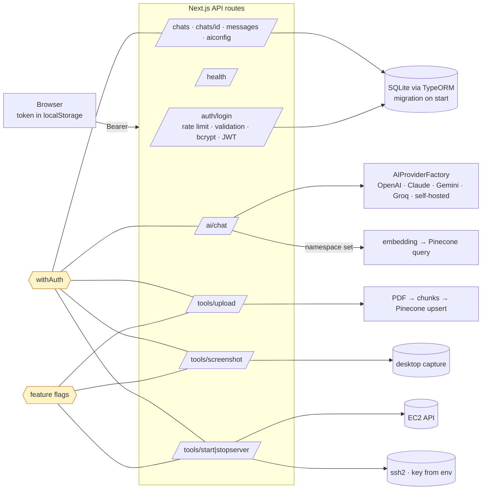
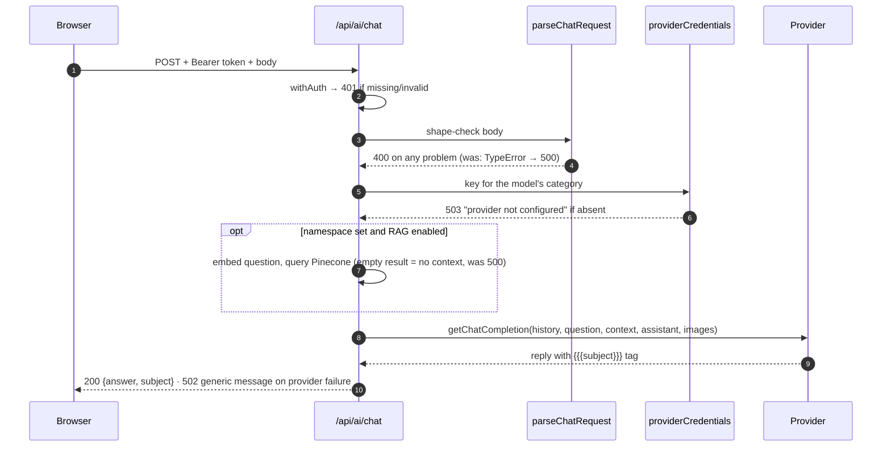

# SmartChat

[](https://github.com/daniellopez882/smartchat/actions/workflows/ci.yml)


A single-user chat application for talking to OpenAI, Anthropic, Gemini and
Groq models (and a self-hosted model through the companion
[smartchat-fastapi](https://github.com/daniellopez882/smartchat-fastapi)
server), with file and image input, optional retrieval over uploaded PDFs
(Pinecone), saved assistants, and chat history in SQLite. Next.js 15 (Pages
Router), TypeScript, TypeORM on better-sqlite3.

> **What changed.** The application had a login, and five of its nine API
> routes did not use it: anyone who could reach the port could spend the
> model credit, upload files, receive a **screenshot of the host's desktop**,
> and start an EC2 instance and run `systemctl` on it over SSH with a private
> key read from a path supplied in the request. Every route authenticates
> now; the host-level tools are off unless enabled; a fresh clone gets a
> database (it did not); and the build no longer needs every provider's key.
> Each defect below was reproduced before it was fixed.

## At a glance

| | |
|---|---|
| **Is** | A personal multi-provider chat app with RAG, meant for one user on their own machine |
| **Auth** | JWT login (bcrypt, 12 h tokens, rate-limited, validated); `withAuth` on every route except login and health; chats are owner-scoped |
| **Optional tools** | `ENABLE_SCREENSHOT_TOOL`, `ENABLE_REMOTE_SERVER_TOOLS` + `REMOTE_SERVER_PEM_PATH` — off by default; 404 otherwise |
| **Tests** | 68 — API handlers called directly with a mock request/response and an in-memory SQLite; provider and Pinecone clients are stubs; no network |
| **CI** | eslint (now covering TypeScript) · `tsc` · vitest · build without secrets · `audit-ci` at high with an explained allowlist · gitleaks · container: non-root, migrates on start, health checked, anonymous requests to chat/screenshot/startserver get 401 |

## Architecture



### A chat request



## Getting started

```bash
npm ci
cp .env.example .env      # set JWT_SECRET, DEFAULT_USERNAME/PASSWORD, and the provider keys you use
npm run dev               # http://localhost:3000 — the database and its tables are created on first request
```

The first login with `DEFAULT_USERNAME`/`DEFAULT_PASSWORD` creates the only
user. In production the `.env.example` pair (`admin`/`smartchat`) is refused
unless `ALLOW_DEFAULT_CREDENTIALS=true`.

```bash
npm test && npm run lint && npm run typecheck && npm run build
```

### Container

```bash
docker build -t smartchat .
docker run --rm -p 3000:3000 --env-file .env -v smartchat-data:/data smartchat
```

Node 24, uid 10001, the database on `/data`. The screenshot and
remote-server tools are not meaningful in a container and stay off.

## Configuration

| Variable | Required | Notes |
|---|---|---|
| `JWT_SECRET` | yes | Signs sessions |
| `DEFAULT_USERNAME` · `DEFAULT_PASSWORD` | yes | First-login credentials; shipped defaults refused in production |
| `NEXT_PUBLIC_API_URL` | yes | Where the browser reaches the app |
| `OPENAI_API_KEY` · `CLAUDE_API_KEY` · `GEMINI_API_KEY` · `GROQ_API_KEY` | per provider | A model whose provider is missing returns 503 |
| `PINECONE_API_KEY` · `PINECONE_INDEX_NAME` | for RAG | Without both, upload is disabled and chat runs without retrieval |
| `NEXT_PUBLIC_SERVER_URL` · `NEXT_PUBLIC_SERVER_GPU_URL` · `NEXT_PUBLIC_SERVER_SECRET_KEY` | for self-hosted models | The companion FastAPI server |
| `DATABASE_PATH` | no | Default `database.sqlite` |
| `ENABLE_SCREENSHOT_TOOL` | no | Off. Captures this machine's desktop |
| `ENABLE_REMOTE_SERVER_TOOLS` · `REMOTE_SERVER_PEM_PATH` · `AWS_*` | no | Off. EC2 start/stop + `systemctl` over SSH |
| `TRUST_PROXY` | no | Believe `X-Forwarded-For` for rate limiting |
| `ALLOW_DEFAULT_CREDENTIALS` | no | Permit the shipped defaults in production |

## What changed, and why

| # | Defect | Effect |
|--:|---|---|
| 1 | `/api/ai/chat` had no authentication | Anyone reaching the port spent the provider credit ([ADR 0001](docs/adr/0001-every-route-authenticates.md)) |
| 2 | `/api/tools/screenshot` had no authentication | Returned a screenshot of the **host machine's desktop** to any caller |
| 3 | `/api/tools/startserver` and `stopserver` had no authentication, took `pemPath` from the body and interpolated `appName` into `systemctl … ${appName}` | Arbitrary file read on the server, command injection over SSH, EC2 start/stop — anonymously |
| 4 | `/api/tools/upload` had no authentication, no type or size limit, `JSON.parse` on raw fields, temp file leaked on error | Anyone could write files to disk and pay for their embeddings; the only loader reads PDFs |
| 5 | Chat routes looked chats up by id alone | Any token could rename, read, append to or delete any chat |
| 6 | Login validators were built but never executed; `.escape()` would have altered passwords | No input validation at all on login |
| 7 | Rate limiter keyed on `x-forwarded-for` | A client chose its own bucket by setting a header |
| 8 | `.env.example` credentials created the only user | `admin`/`smartchat` on every unconfigured deployment; refused in production now |
| 9 | `synchronize: false` with a migrations glob pointing at a directory that did not exist | A fresh clone had no tables: first login failed with *no such table: users*; the README's `typeorm migration:run` had nothing to run ([ADR 0002](docs/adr/0002-configuration-at-use-and-a-real-migration.md)) |
| 10 | `config/env.ts` threw at import for four variables; `pineconeClient.ts` had a top-level `await` | The login page and the build needed every provider configured |
| 11 | `fetchDataFromPinecone` threw on an empty result | A question in an empty namespace was a 500, not an answer without context |
| 12 | `chat.ts` read `fileSrc.length` before checking the body | Malformed bodies crashed the handler; category and model were unchecked |
| 13 | `eslint.config.cjs` listed only `**/*.js` | The TypeScript application had never been linted |
| 14 | Client fetches for chat, screenshot and upload sent no token | Required now that the routes check one |
| 15 | No tests, no CI, no container; `next@14.2.13` with known advisories | Nothing checked anything; Next is 15.5 and lucide-react 1.x now (several advisories are only fixed there, one for Pages Router apps). The dependency set needs Node ≥ 22 (`openai`, `undici`, `jsdom`), so the image, CI and `engines` say Node 24 |
| 16 | `langchain@0.0.96` (mid-2023) for four imports | Carried an `axios` with a dozen advisories; the four imports moved to the split `@langchain/*` packages with the same APIs |
| 17 | `sqlite3` had no prebuilt binary for current Node and fell back to a native build | The install failed on a stock developer machine; `better-sqlite3` ships prebuilds and drops the `node-pre-gyp`/`tar` chain |
| 18 | `xlsx@0.18.5`: prototype pollution and ReDoS advisories with no fixed release on npm | Installed from SheetJS's own distribution (0.20.3) instead |
| 19 | `eslint-config-next` unused by the flat config; `eslint-plugin-next@0.0.0` (a placeholder package); `isomorphic-dompurify` declared as a dev dependency but imported by the client | Dead and misfiled dependencies; a production install would have lacked the sanitiser |
| 20 | `yarn.lock` with no way to pin transitive advisories by version range | Moved to npm (`package-lock.json`, `overrides`, `npm audit fix`) |
| 21 | A `.babelrc` with preset-env, preset-typescript, preset-react and the legacy decorator plugins | Disabled Next's SWC compiler: `next build` took 61–93 s here instead of 10 s, `compiler` options were ignored, and every lucide-react icon import produced a false *'X' is not exported* warning (26 of them). tsconfig's `experimentalDecorators`/`emitDecoratorMetadata` is all TypeORM needs from SWC; the file and the eight `@babel/*` packages are gone |

## Design notes

| Record | Decision |
|---|---|
| [ADR 0001](docs/adr/0001-every-route-authenticates.md) | Every route authenticates; host-level tools are opt-in and validated |
| [ADR 0002](docs/adr/0002-configuration-at-use-and-a-real-migration.md) | Configuration checked where used; the schema is a migration |
| [Threat model](docs/threat-model.md) | Eight threats, what was open, what remains |

## Layout

```
src/pages/api/        auth/login · health · ai/chat · tools/{upload,screenshot,startserver,stopserver} · chats/… · aiconfig
src/middleware/       auth.ts (withAuth, login validation, limiter) · guards.ts (withMethods, requireFeature)
src/utils/            remoteTools.ts · uploadPolicy.ts · serverToolHandler.ts · fileHelper · guardrails
src/services/         llm/ (providers) · rag/ (Pinecone, embeddings, PDF split) · aws/
src/db/               entities · data-source (migration imported) · migrations/
config/env.ts         live getters, requireEnv, feature flags
tests/                API handler tests with a mock request/response and in-memory SQLite
docs/                 ADRs, threat model
```

## Limits

- One user by design. The token lives in `localStorage` (see the threat model).
- `xlsx` comes from SheetJS's own distribution because the npm registry copy
  has no fixed release; `.audit-allowlist.json` lists any advisory CI is told
  to ignore, with its reason in the threat model.
- The self-hosted model path depends on the companion server and is untested here.
- The image is 1.7 GB: TypeORM loads its driver with a dynamic `require` that
  Next's standalone tracing does not follow, so `node_modules` ships whole.
- The UI was checked by hand against the image (login, chat page, every icon
  rendering); there are no browser tests.

## Licence

MIT — see [LICENSE](LICENSE).
